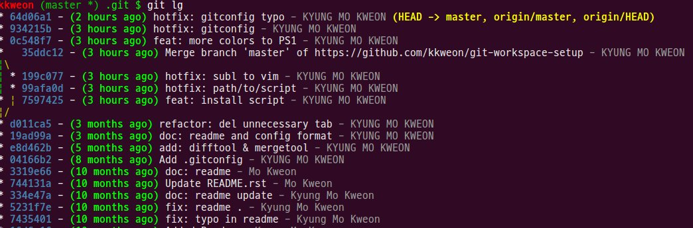

# Git Prompt Script & .gitconfig
To myself in the future, please read first. `.bashrc` can be overwritten.

## Installation

Before installing, make sure 

* Backup your `~/.bashrc`
* There should be no directory as `~/.git/`

```bash
wget https://raw.githubusercontent.com/kkweon/git-workspace-setup/master/git_workspace_install.sh -O- | bash
```


## Features
* bash: username (branch) pwd  --> No change  
* bash: username (branch \*) pwd --> There exists untracked file  
* bash: username (branch \+) pwd --> There exists staged files  

## Examples
```
kkweon (master *) .git $ 
```



